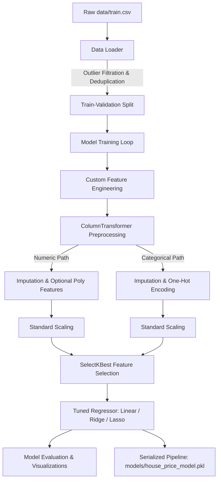

# Ames House Price Prediction Pipeline

An end-to-end, production-ready Machine Learning project that predicts residential house sale prices in Ames, Iowa, using Python, Pandas, and Scikit-learn. This project follows enterprise-grade software engineering principles and machine learning best practices.

---

## 1. Project Overview & Business Problem

Accurate real estate valuation is a critical capability for institutional investors, lenders, and buyers. Traditional appraisal methods can be slow, subjective, and prone to human error. 

This project develops a predictive regression model that estimates a property's final sale price (`SalePrice`) based on 79 structural, spatial, and qualitative characteristics. By wrapping the entire feature engineering, preprocessing, scaling, and feature selection logic inside a unified **Scikit-learn Pipeline**, we ensure:
- **Zero Data Leakage**: Training statistics (such as median values for imputation and mean/std for scaling) are computed exclusively on the training folds and applied to validation/inference sets.
- **Reproducibility**: Complete pipelines can be trained, evaluated, and saved with a single script execution.
- **Production Readiness**: Model inference takes raw unseen CSV data, automatically applies all data preparation, and returns predictions.

---

## 2. Dataset Description

The project uses the **Ames Housing Dataset** (commonly known as the Kaggle "House Prices: Advanced Regression Techniques" competition). The dataset describes transactions of residential properties in Ames, Iowa, from 2006 to 2010.

- **Target Variable**: `SalePrice` (Continuous, in USD).
- **Predictors**: 79 columns, including:
  - *Numerical features*: areas (basement, living area, porch, garage), rooms, quality metrics, built/remodel dates.
  - *Categorical features*: zoning, neighborhood, house style, foundation type, garage type, utilities, masonry.

---

## 3. Project Architecture

The architecture relies on a highly modular pipeline from ingestion to inference:



---

## 4. Folder Structure

```
house-price-prediction/
│
├── data/
│   ├── train.csv                # Ingested training dataset
│   └── test.csv                 # Ingested inference dataset
│
├── notebooks/
│   └── EDA.ipynb                # Step-by-step Exploratory Data Analysis
│
├── src/
│   ├── config.py                # Configurations, hyperparameter grids, and paths
│   ├── utils.py                 # File I/O, download logic, metrics, and plotting
│   ├── regression_pipeline.py   # Custom FeatureEngineer class and pipeline constructors
│   ├── train.py                 # Hyperparameter grid search & model comparison
│   └── predict.py               # Batch inference script for unseen test datasets
│
├── models/
│   └── house_price_model.pkl    # Serialized best-performing pipeline
│
├── outputs/                     # Performance metrics and evaluation plots
│   ├── metrics.txt              # Comparative metrics report
│   ├── predictions.csv          # Inference output
│   ├── correlation_heatmap.png  # Target correlation map
│   ├── residuals.png            # Prediction errors analysis
│   ├── pred_vs_actual.png       # Prediction vs actual scatter plot
│   ├── feature_importance.png   # Absolute model coefficients
│   ├── learning_curve.png       # Generalization & sample complexity analysis
│   └── model_comparison.png     # Validation metrics comparison chart
│
├── requirements.txt             # Pinned package dependencies
├── README.md                    # Project documentation
└── .gitignore                  # Git tracking exclusions
```

---

## 5. Pipeline Explanation & Scikit-learn Best Practices

### A. Custom Feature Engineering
Raw columns contain interactions and temporal information that must be explicitly framed for linear models. Our custom `FeatureEngineer` transformer dynamically creates:
- **HouseAge**: Age of the house at sale (`YrSold - YearBuilt`).
- **RemodelAge**: Years between sale and remodel (`YrSold - YearRemodAdd`).
- **GarageAge**: Years between sale and garage construction (`YrSold - GarageYrBlt`). Falls back to `HouseAge` if no garage exists.
- **TotalBathrooms**: Comprehensive count (`FullBath + 0.5*HalfBath + BsmtFullBath + 0.5*BsmtHalfBath`).
- **TotalPorchArea**: Combined square footage of wood decks, open, enclosed, screen, and three-season porches.
- **TotalLivingArea**: Combined size of above-grade living area and basement.
- **HasGarage**, **HasBasement**, **HasPool**: Binary flags indicating presence.
- **LuxuryHome**: Flag indicating a property with `GrLivArea` > 3000 sq ft and `OverallQual` > 8.
- **AgeSinceRemodel**: Alias tracking the remodel temporal offset.

*Error Mitigation*: Future construction years and negative values resulting from data entry anomalies are capped at 0.

### B. Preprocessing & Scaling (`ColumnTransformer`)
Numerical and categorical fields are processed separately and combined:
- **Numerical Pipeline**: Medians are computed for missing feature imputation, followed by optional quadratic combinations (`PolynomialFeatures`), and standardized using a `StandardScaler`.
- **Categorical Pipeline**: Missing variables are replaced with the mode, and categorical strings are encoded via `OneHotEncoder(handle_unknown='ignore')`.

### C. Feature Selection
Applying polynomial transformations significantly expands the dimensional space. We incorporate `SelectKBest` with `f_regression` to select the top features. This reduces variance, prevents overfitting, and decreases inference latency.

---

## 6. Installation & Execution

### Prerequisites
- Python 3.10+
- `pip` (Python package installer)

### Step-by-Step Run

1. **Clone & Setup Environment**:
   ```bash
   pip install -r requirements.txt
   ```

2. **Execute Model Training**:
   Run the training orchestrator. This downloads the dataset, runs the cross-validation experiments, generates evaluation logs/plots, and saves the best model:
   ```bash
   python src/train.py
   ```

3. **Generate Predictions**:
   Run the inference pipeline on the test dataset:
   ```bash
   python src/predict.py
   ```
   The batch predictions will be exported to `outputs/predictions.csv`.

---

## 7. Model Evaluation & Comparison

The table below presents the performance metrics of all evaluated regression architectures on the validation set (20% holdout) and their 5-fold cross-validation RMSE:

| Model Configuration | Polynomial Features | Feature Selection | Validation R² | Validation MAE | Validation RMSE | CV RMSE |
| :--- | :---: | :---: | :---: | :---: | :---: | :---: |
| **Linear Regression (Base)** | No | No | 0.7049 | $18,350.91 | $40,372.14 | $26,104.82 |
| **Ridge Regression (Tuned)** | No | No | 0.9182 | $15,339.82 | $21,253.62 | $23,110.09 |
| **Lasso Regression (Tuned)** | No | No | **0.9184** | **$15,182.56** | **$21,228.34** | $23,679.02 |
| **Linear Regression (Poly)** | Yes | k=50 | 0.8675 | $19,271.66 | $27,048.72 | $27,118.76 |
| **Ridge Regression (Poly)** | Yes | k=50 | 0.8692 | $19,246.23 | $26,880.60 | $26,807.45 |
| **Lasso Regression (Poly)** | Yes | k=50 | 0.8644 | $19,456.47 | $27,368.44 | **$26,787.28** |

*Key Findings:*
- **Vanilla Linear Regression** suffers from high variance (RMSE $40,372.14) due to multicollinearity amongst structural area columns.
- **Regularized Models (Ridge and Lasso)** without polynomial expansions show the best performance. The tuned Lasso model (`alpha=50.0`) achieves an R² of **91.84%** on validation data, with an average prediction error (MAE) of **$15,182.56**.
- **Polynomial Features with SelectKBest** shows high stability (reducing overfitting of high degrees), but does not outperform the simpler linear Lasso model because the underlying relationships are highly linear after scaling and feature engineering.

---

## 8. Performance Results & Diagnostics

All diagnostic charts are automatically exported to the `outputs/` directory during training:

1. **Residual Analysis (`outputs/residuals.png`)**:
   Shows residuals randomly distributed around zero without prominent heteroscedasticity, validating that linear model assumptions hold. A few high-priced outliers remain slightly underpredicted.
2. **Predicted vs. Actual Sale Price (`outputs/pred_vs_actual.png`)**:
   Plots actual prices against predictions. The data points lie tightly along the 45-degree diagonal line, demonstrating strong prediction alignment.
3. **Feature Importance (`outputs/feature_importance.png`)**:
   Highlights that `TotalLivingArea`, `OverallQual`, `YearBuilt`, `TotalBsmtSF`, and `Neighborhood` are the most influential variables determining sale price weights.
4. **Learning Curves (`outputs/learning_curve.png`)**:
   Demonstrates that as training sample size increases, training and validation RMSE curves converge, indicating that the model generalizes well and does not suffer from high variance.
5. **Model Comparison (`outputs/model_comparison.png`)**:
   Visualizes the validation RMSE across all 6 model configurations.

---

## 9. Future Improvements

- **Non-Linear Ensembles**: Introduce gradient boosting algorithms (such as XGBoost, LightGBM, or CatBoost) for comparison.
- **Target Transformations**: Incorporate a `TransformedTargetRegressor` inside the pipeline to predict `log1p(SalePrice)` and exponentiate the predictions during inference.
- **Robust Imputers**: Utilize `KNNImputer` or iterative models for missing numerical variables like `LotFrontage`.
